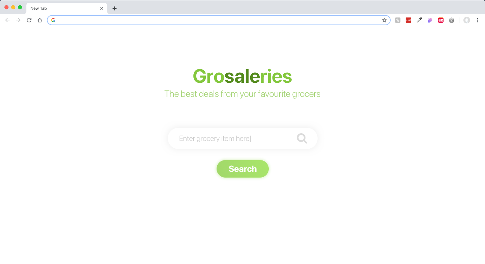
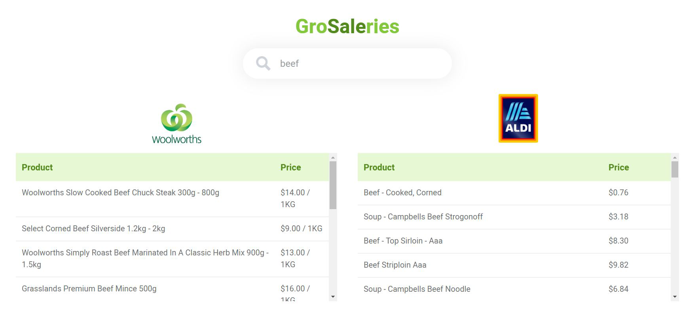

# GroSaleries Front-End
Front-end codebase for GroSaleries web application.

GroSaleries is a price aggregator for Australian residents looking for cheapest grocery products.

# Requirements
- jQuery 3.3.1
- QUnit 2.9.2
- Bootstrap 4.3.1

# Demo
- Starting screen

- Results

